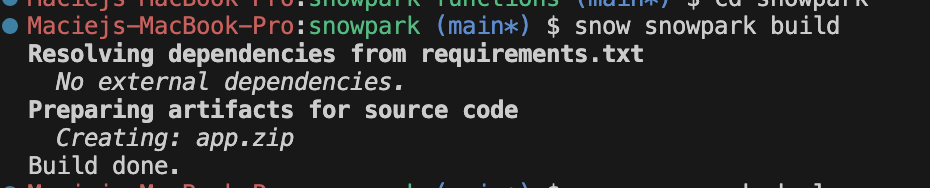
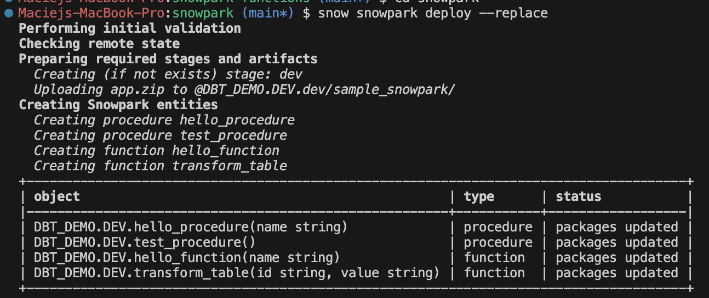
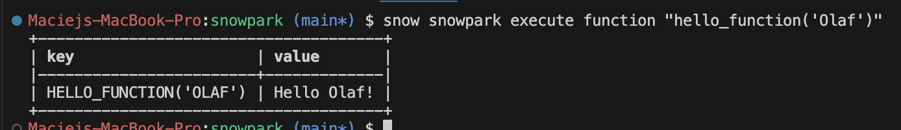

# snowpark-functions
Sample snowpark functions using Snowpark API

Documentation: https://docs.snowflake.com/en/developer-guide/snowflake-cli/snowpark/overview


## Steps
Initialise the project
```bash
snow init snowpark --template-source https://github.com/snowflakedb/snowflake-cli-templates --template example_snowpark
```
Follow the guide to provide some parameters.  

cd to the newly created folder
```bash
cd snowpark
```
Build the project
```bash
snow snowpark build
```
<p align="center">
  
</p>
Deploy the project

```bash
# create a zip for the package
zip -r python_package.zip python_package
# deploy the project
snow snowpark deploy --replace
```
<p align="center">
  
</p>
This will deploy the functions and procedures to your Snowflake environment using credentials from your `.snowalake/config.toml` file. Credentials and other parameters can also be provided with CLI flags.  

More information about Snowpark project definition: https://docs.snowflake.com/en/developer-guide/snowflake-cli/snowpark/create#label-snowcli-create-snowpark

### Snowpark function

Functions can be defined very similarly to regular Python functions, e.g.:
```python
def hello_function(name: str) -> str:
    return f"Hello {name}
```
For the function to be pushed to Snowflake, you need to add it to `snowflake.yaml` file, e.g.:
```yaml
entities:
  hello_function:
    type: function
    identifier:
      name: hello_function
    handler: python_package.functions.hello_function
    signature:
      - name: name
        type: string
    returns: string
    meta:
      use_mixins:
        - snowpark_shared
```
### Snowpark table functions

Table functions (or UDTFs) are a special type of functions that return a single value per input value - in other words - they take a table and return a table with some transformations applied for each row.

Defining them with Python is slightly more complicated though, as they require a class with `process()` function that yields results, e.g.
```python
class TransformTable:
    def process(self, id, value):
        # processes each input row
        yield (id, f"Hello {value}!")
```
Sample definition in `snowflake.yaml` file, e.g.:
```yaml
  transform_table:
    type: function
    identifier:
      name: transform_table
    handler: python_package.table_functions.TransformTable
    signature:
      - name: id
        type: string
      - name: value
        type: string
    returns: TABLE (id VARCHAR, new_value VARCHAR)
    meta:
      use_mixins:
        - snowpark_shared
```
More information on defining these: https://docs.snowflake.com/en/developer-guide/udf/python/udf-python-tabular-functions

## Execution

### Local

To execute the function locally
```bash
snow snowpark execute function "hello_function('Olaf')"
```

<p align="center">
  
</p>

### Examples and dbt models

Once deployed, they can be used in your Snowflake or Python code.  
Scalar functions:
```sql
select
    id,
    dev.hello_function(name) as augmented_name,
from source_data
```
```python
result_df = source_df.select(
      "id",
      session.call_function("dev.hello_function", source_df["name"]).alias("augmented_name")
  )
```
And table functions:
```sql
SELECT transform_table.id, transform_table.new_value
  FROM source_data, TABLE(DBT_DEMO.DEV.transform_table(id, value));
```
```python
sql = 
result_df = session.sql(
  f"""
    SELECT t.id, t.value
    FROM {input_df} t,
    TABLE(dev.transform_table(t.id, t.value))
"""
)
```

Sample dbt models for functions and table functions can be found in `sample_dbt_models` directory.

## Snowpark packages

While the above deploys the code as functions and stored procedures in Snowflake, there is an alternative way to deploy them as packages or individual Python files.

### Individual Python files

Indovidual Python files can be deployed to Snowflake stages and then accessed in Python code.

For example, to deploy a single Python file
```bash
cd snowpark/python_package
snow snowpark package upload --file="sample_function.py" --stage="packages" --overwrite --schema dev
```
That file can be be added to imports in your dbt Python model and used with
```python
from snowflake.snowpark.functions import lit
def model(dbt, session):
    dbt.config(
        materialized = "table",
        imports = ['@dbt_demo.dev.packages/sample_function.py'],
    )
    import sample_function
    source_df = dbt.ref("raw_table")  
    final_df = source_df.withColumn("CHECK", lit(sample_function.print_hello("Alice")))
    return final_df
```

### Python packages

First, we need to zip the code as a package. Ensure that you have `__init__.py` files in any folders
```bash
cd snowpark
zip -r python_package.zip python_package
cd ..
```
You can also achieve this with running snow command `snow snowpark build`.  
The package can then be uploaded to Snowflake
```bash
snow snowpark package upload --file="python_package.zip" --stage="packages" --overwrite --schema dev
```

That package can be be added to imports in your dbt Python model. Note it needs to be zipper with the folder name and Python files inside this folder. When Snowflake unpacks it - it will refer to that folder name as the package name.
```python
from snowflake.snowpark.functions import lit

def model(dbt, session):

    dbt.config(
        materialized = "table",
        imports = ['@dbt_demo.dev.packages/python_package.zip'],
    )

    from python_package import functions
    functions.hello_function('name')

    # Get tables using dbt's ref function to reference the raw_pos models
    locations_df = dbt.ref('raw_pos_location')
    final_df = (
        locations_df.withColumn("CHECK", lit(functions.hello_function("Mirian")))
    )
    
    return final_df
```

## Testing

Functions can be tested locally if they contain main block for local testing/debugging, e.g.
```python
# For local debugging
# Be aware you may need to type-convert arguments if you add input parameters
if __name__ == "__main__":
    print(hello_function(*sys.argv[1:]))  # type: ignore
```
This can be tested by running
```bash
python3 snowpark/app/functions.py Jane
```
Pytest can also be used, more info in [Snowflake documentation](https://docs.snowflake.com/en/developer-guide/snowpark/python/testing-python-snowpark)
